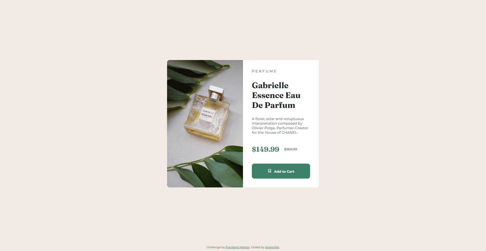
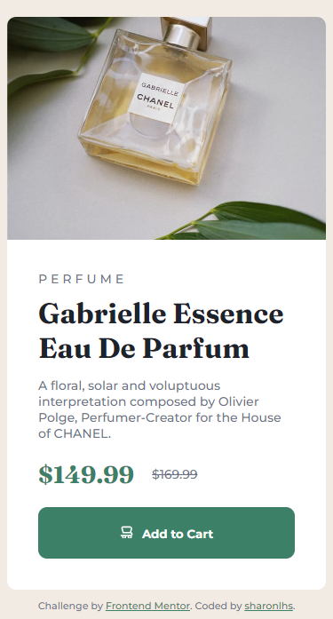

# Frontend Mentor - Product preview card component solution

This is a solution to the [Product preview card component challenge on Frontend Mentor](https://www.frontendmentor.io/challenges/product-preview-card-component-GO7UmttRfa). Frontend Mentor challenges help you improve your coding skills by building realistic projects. 

## Table of contents

- [Overview](#overview)
  - [The challenge](#the-challenge)
  - [Screenshot](#screenshot)
  - [Links](#links)
  - [Built with](#built-with)
  - [What I learned](#what-i-learned)
  - [Continued development](#continued-development)
  - [Useful resources](#useful-resources)
- [Author](#author)


**Note: Delete this note and update the table of contents based on what sections you keep.**

## Overview

### The challenge

Users should be able to:

- View the optimal layout depending on their device's screen size
- See hover and focus states for interactive elements

### Screenshot





### Links
- Git URL: [GitHub URL](https://github.com/sharonlhs/product-preview-card-component-main)
- Solution URL: [Frontend Mentor URL](https://www.frontendmentor.io/solutions/product-preview-card-component-with-html-and-css-PxmbaBXgxs)
- Live Site URL: [Vercel URL](https://product-preview-card-component-main-sigma-seven.vercel.app/)


### Built with

- Semantic HTML5 markup
- CSS custom properties
- Mobile-first workflow


### What I learned
Learned how to set different images for different screen type with HTML and manipulate how the card looks like differently on desktop and mobile with CSS

`srcset` defines the set of images we will allow the browser to choose between, and what size each image is. Each set of image information is separated from the previous one by a comma.

`HTML`
```
 
```

`CSS`
```
@media only screen and (max-width: 600px) {}
```

### Continued development

To enhance more on using flexbox and learn other different ways to showcase product details in desktop/mobile view

### Useful resources

- [Flexbox ](https://css-tricks.com/snippets/css/a-guide-to-flexbox/) -- Helped me to use flexbox
- [Responsive Images in HTML](https://developer.mozilla.org/en-US/docs/Learn/HTML/Multimedia_and_embedding/Responsive_images#resolution_switching_different_sizes) -- Helped me to make images responsive (Improve UI/UX for desktop and mobile)
- [Media conditions in CSS for different viewport](https://developer.mozilla.org/en-US/docs/Web/CSS/Media_Queries/Using_media_queries#improving_compatibility_with_older_browsers) -- Helped to make images responsive depending on device type


## Author

- Frontend Mentor - [@sharonlhs](https://www.frontendmentor.io/profile/sharonlhs)
- LinkedIN - [@sharonlhs](https://www.linkedin.com/in/sharonlhs/)
- Twitter - [@sharonlhs](https://www.twitter.com/sharonlhs)

